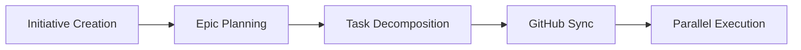

# TCCPM – Tailored CCPM

A customized variant of [CCPM](https://github.com/automazeio/ccpm) (Claude Code Project Manager) with Initiative terminology, `.ccpm/` data directory, local-only mode, root-anchored scripts, and additional features.

### Spec-driven development for AI agents – ship better using Initiatives, GitHub issues, and multiple agents running in parallel.

---

## What's Different from Upstream CCPM

| Feature | Upstream CCPM | TCCPM |
|---------|--------------|-------|
| Terminology | PRD | Initiative |
| Data directory | `.claude/prds/`, `.claude/epics/` | `.ccpm/initiatives/` (nested) |
| Task IDs | Sequential per epic | Globally unique (`.ccpm/next-id`) |
| GitHub | Required | Optional (local-only mode) |
| Root anchoring | Not enforced | All scripts `cd` to git root |
| Multi-epic | Single-epic only | Initiative decomposition, epic-start-all |
| Context management | Not included | Create, update, prime context |

---

## The Workflow



### See It In Action

```
"I want to build a notification system"
  -> Guided brainstorming + Initiative creation

"break down the notification-system epic"
  -> Parallelizable task files with dependencies

"sync the notification-system epic to GitHub"
  -> Epic issue + sub-issues + worktree

"start working on issue 42"
  -> Parallel stream analysis + multiple agents launched

"what's our standup for today?"
  -> Instant report from project files
```

---

## Install

TCCPM is a standard [Agent Skill](https://agentskills.io). Point your harness at `skill/ccpm/`.

### Claude Code

In your project root:

```bash
mkdir -p .claude/skills
ln -s /path/to/tccpm/skill/ccpm .claude/skills/ccpm
```

### Any Agent Skills-compatible harness

Point it at `skill/ccpm/`. It follows the [agentskills.io](https://agentskills.io) standard.

### Prerequisites

- `git` (required)
- `gh` CLI (optional — for GitHub integration)

---

## Usage

TCCPM activates automatically when your agent detects PM intent. Just talk naturally.

| What you say | What happens |
|---|---|
| "I want to build X" / "let's plan X" | Brainstorming + Initiative creation |
| "parse the X initiative" | Initiative -> technical epic |
| "break down the X epic" | Epic decomposition into tasks |
| "sync the X epic to GitHub" | Issues created, worktree set up |
| "start working on issue N" | Analysis + parallel agents launched |
| "standup" / "what's our status" | Bash script runs instantly |
| "what's next" / "what's blocked" | Priority queue from project files |

---

## Skill Structure

```
skill/ccpm/
|-- SKILL.md                  # Entry point
|-- references/
    |-- plan.md               # Initiative writing + parsing to epic
    |-- initiative.md          # Multi-epic decomposition + coordination
    |-- structure.md          # Epic decomposition into tasks
    |-- sync.md               # GitHub sync
    |-- execute.md            # Parallel agent launch
    |-- track.md              # Status, standup, search
    |-- context.md            # Context management
    |-- conventions.md        # File formats, schemas, rules
    |-- scripts/              # Bash scripts for deterministic ops
```

Your project files live in `.ccpm/` in your project root:

```
.ccpm/
|-- initiatives/
|   |-- <name>.md             # Initiative document
|   |-- <name>/               # Epics for this initiative
|       |-- <epic>/
|           |-- epic.md       # Technical epic
|           |-- <N>.md        # Task files (globally unique IDs)
|-- archive/                  # Completed initiatives
|-- next-id                   # Global task ID counter
```

---

## Key Features

- **Context preservation** — project state lives in files, not chat history
- **Parallel execution** — tasks marked `parallel: true` run concurrently
- **GitHub native** — optional integration with issues and worktrees
- **Local-only mode** — works without GitHub, `.ccpm/` is source of truth
- **Deterministic ops** — status, standup, search run as bash scripts
- **Root-anchored** — all scripts resolve `.ccpm/` from git project root

---

## License

MIT — see [LICENSE](LICENSE).

Based on [CCPM](https://github.com/automazeio/ccpm) by [Automaze](https://automaze.io).
