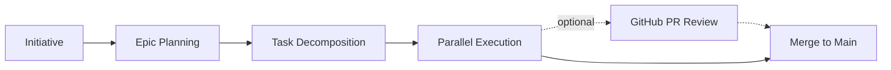

# TCCPM — Tailored CCPM

[](https://github.com/automazeio/ccpm)
&nbsp;
[](https://agentskills.io)
&nbsp;
[](LICENSE)

### Spec-driven development for AI agents — ship better using Initiatives and multiple agents running in parallel.

Stop losing context. Stop blocking on tasks. Stop shipping bugs. TCCPM turns Initiatives into epics, epics into tasks, and tasks into production code — with full traceability at every step.

> **This is a tailored variant** of [automazeio/ccpm](https://github.com/automazeio/ccpm) v2 with additional features: multi-epic initiatives, local-only mode (GitHub optional), context management, `.ccpm/` data separation, globally unique task IDs, `@ccpm` explicit invocation, and an optional GitHub PR review loop.

## Table of Contents

- [Background](#background)
- [The Workflow](#the-workflow)
- [What Makes This Different?](#what-makes-this-different)
- [Core Principle: No Vibe Coding](#core-principle-no-vibe-coding)
- [System Architecture](#system-architecture)
- [Workflow Phases](#workflow-phases)
- [Usage](#usage)
- [The Parallel Execution System](#the-parallel-execution-system)
- [Key Features & Benefits](#key-features--benefits)
- [Get Started Now](#get-started-now)
- [Worktree Isolation](#worktree-isolation)
- [GitHub PR Review Loop](#github-pr-review-loop)
- [Project-Mode Settings](#project-mode-settings)
- [Permissions](#permissions)
- [Tailoring-Specific Features](#tailoring-specific-features)
- [License](#license)

## Background

Every team struggles with the same problems:
- **Context evaporates** between sessions, forcing constant re-discovery
- **Parallel work creates conflicts** when multiple developers touch the same code
- **Requirements drift** as verbal decisions override written specs
- **Progress becomes invisible** until the very end

This system solves all of that.

## The Workflow



### Simple — Small Features

Go from idea to running agents in one step:

```
@ccpm create an initiative for memory-system     # Brainstorm and write the initiative
@ccpm initiative-go memory-system                # Parse -> decompose -> start agents
@ccpm merge the memory-system initiative         # Merge everything to main
```

### Step-by-Step — Single Epic, Full Control

Pause between phases to review and refine:

```
@ccpm create an initiative for memory-system     # Brainstorm
@ccpm decompose memory-system into epics         # Convert to technical epic(s)
@ccpm break down the memory-system epic          # Break into tasks
@ccpm start the memory-system epic               # Launch parallel agents

# Optional GitHub PR review loop (requires gh auth login):
@ccpm push the memory-system initiative for review   # Push branch; open PR manually
# (review on GitHub; leave comments)
@ccpm address review comments for memory-system      # Apply fixes + reply on threads + re-push
# (re-review; loop until satisfied)

@ccpm merge the memory-system initiative         # Merge everything to main
```

### Multi-Epic — Large Initiatives (up to 10 epics)

For features that need multiple coordinated epics:

```
@ccpm create an initiative for auth-system       # Brainstorm
@ccpm decompose auth-system into epics           # Break into multiple epics

# Decompose each epic (review and refine between steps):
@ccpm break down the login-flow epic             # Break first epic into tasks
@ccpm break down the oauth-providers epic        # Break second epic into tasks

# Start all epics sequentially — no interaction until done:
@ccpm start all epics for auth-system

# Optional GitHub PR review loop (requires gh auth login):
@ccpm push the auth-system initiative for review     # Push branch; open PR manually
# (review on GitHub; leave comments)
@ccpm address review comments for auth-system        # Apply fixes + reply on threads + re-push
# (re-review; loop until satisfied)

@ccpm merge the auth-system initiative           # Merge everything to main
```

> **Tip:** Prefix any message with `@ccpm` to ensure CCPM handles it (bypasses Claude's built-in planning mode). You can also use natural language — CCPM activates when you mention initiatives, epics, or tasks.

## What Makes This Different?

| Traditional Development | CCPM |
|------------------------|------|
| Context lost between sessions | **Persistent context** across all work |
| Serial task execution | **Parallel agents** on independent tasks |
| "Vibe coding" from memory | **Spec-driven** with full traceability |
| Progress hidden in branches | **Transparent audit trail** in local files |
| Manual task coordination | **Intelligent prioritization** via `@ccpm what's next` |

## Core Principle: No Vibe Coding

> **Every line of code must trace back to a specification.**

We follow a strict 5-phase discipline:

1. **Brainstorm** - Think deeper than comfortable
2. **Document** - Write specs that leave nothing to interpretation
3. **Plan** - Architect with explicit technical decisions
4. **Execute** - Build exactly what was specified
5. **Track** - Maintain transparent progress at every step

No shortcuts. No assumptions. No regrets.

## System Architecture

TCCPM is an **Agent Skill** installed as a symlink or copy in `.claude/skills/ccpm/`. The skill definition lives in `skill/ccpm/` and PM data lives in `.ccpm/` (separate from project configuration in `.claude/`).

```
<your-project>/
├── .claude/
│   ├── skills/
│   │   └── ccpm -> /path/to/tccpm/skill/ccpm   # Symlink to skill
│   ├── rules/                    # CCPM rules (loaded by harness)
│   └── context/                  # Project context files
└── .ccpm/                        # PM workspace
    ├── settings.yml              # Optional settings (e.g. worktree: true)
    ├── initiatives/
    │   ├── [name].md             # Initiative document
    │   └── [name]/               # Epics for this initiative
    │       └── [epic-name]/      # Epic directory
    │           ├── epic.md       # Epic document
    │           ├── [N].md        # Task files (globally unique IDs)
    │           └── updates/      # Work-in-progress updates
    ├── archive/                  # Completed initiatives
    └── next-id                   # Global task ID counter
```

The skill itself (SKILL.md, reference docs, scripts) lives in `skill/ccpm/` within the TCCPM repository. PM data in `.ccpm/` can be gitignored in consumer projects.

## Workflow Phases

### 1. Plan — Capture requirements

```
@ccpm create an initiative for feature-name
```
Launches comprehensive brainstorming to create an Initiative capturing vision, user stories, success criteria, and constraints.

**Output:** `.ccpm/initiatives/feature-name.md`

### 2. Initiative — Multi-epic decomposition

```
@ccpm decompose feature-name into epics
```
Breaks the initiative into 1-10 epics with dependency ordering.

**Output:** `.ccpm/initiatives/feature-name/[epic-name]/epic.md`

### 3. Structure — Break it down

```
@ccpm break down the epic-name epic into tasks
```
Breaks each epic into concrete, actionable tasks (up to 10 per epic) with acceptance criteria, effort estimates, and parallelization flags.

**Output:** `.ccpm/initiatives/feature-name/[epic-name]/[N].md`

### 4. Execute — Start building

```
@ccpm start the epic-name epic
@ccpm what's next
```
Specialized agents implement tasks while maintaining progress updates. All tasks execute on the initiative branch.

### 5. Review on GitHub (Optional)

```
@ccpm push the feature-name initiative for review
@ccpm address review comments for feature-name
```
Push the initiative branch to GitHub so a PR review can happen before merge. After comments are left on the PR, the second command fetches unresolved threads via `gh`, applies fixes, replies on each thread, and re-pushes. Loop the second command until you are satisfied — threads are not auto-resolved; you decide. CCPM data (initiatives, epics, tasks) is **not** synced to GitHub Issues; only the branch and PR conversation cross.

Requires `gh` to be installed and authenticated (`gh auth login`). See [GitHub PR Review Loop](#github-pr-review-loop) for full details.

### 6. Track and Merge

```
@ccpm what's our status
@ccpm merge the feature-name initiative
```
Merges the initiative branch into main. Validates task completion and runs tests before merging.

## Usage

TCCPM is an Agent Skill activated via natural language. Prefix with `@ccpm` for explicit invocation, or use CCPM vocabulary (initiative, epic, task) for intent-based activation.

### Quick Reference

```
Create initiative:   @ccpm create an initiative for X
Decompose:           @ccpm decompose X into epics
Break into tasks:    @ccpm break down the X epic
Start epic:          @ccpm start the X epic
Start all epics:     @ccpm start all epics for X
Check status:        @ccpm what's our status / @ccpm standup
What's next:         @ccpm what should I work on next
What's blocked:      @ccpm what's blocked
Push for review:     @ccpm push the X initiative for review     (requires gh)
Address comments:    @ccpm address review comments for X        (requires gh)
Merge initiative:    @ccpm merge the X initiative
Create context:      @ccpm create context
Load context:        @ccpm prime context
Search:              @ccpm search for X
Validate:            @ccpm validate project state
Enable worktree:     @ccpm worktree enable X
```

> GitHub integration is optional. TCCPM works in local-only mode without `gh`. The GitHub PR review loop and `gh issue …` sync both require `gh auth login`.

## The Parallel Execution System

### Issues Aren't Atomic

Traditional thinking: One issue = One developer = One task

**Reality: One issue = Multiple parallel work streams**

A single "Implement user authentication" issue isn't one task. It's...

- **Agent 1**: Database tables and migrations
- **Agent 2**: Service layer and business logic
- **Agent 3**: API endpoints and middleware
- **Agent 4**: UI components and forms
- **Agent 5**: Test suites and documentation

All running **simultaneously** on the initiative branch.

### The Math of Velocity

**Traditional Approach:**
- Epic with 3 issues
- Sequential execution

**This System:**
- Same epic with 3 issues
- Each issue splits into ~4 parallel streams
- **12 agents working simultaneously**

We're not assigning agents to issues. We're **leveraging multiple agents** to ship faster.

### Context Optimization

**Traditional single-thread approach:**
- Main conversation carries ALL the implementation details
- Context window fills with database schemas, API code, UI components
- Eventually hits context limits and loses coherence

**Parallel agent approach:**
- Main thread stays clean and strategic
- Each agent handles its own context in isolation
- Implementation details never pollute the main conversation
- Main thread maintains oversight without drowning in code

Your main conversation becomes the conductor, not the orchestra.

### The Workflow

```
# Analyze what can be parallelized
@ccpm start the memory-system epic

# Watch the magic
# 12 agents working across 3 issues
# All on: initiative/memory-system branch

# One clean merge when done
@ccpm merge the memory-system initiative
```

## Key Features & Benefits

### Context Preservation
Never lose project state again. Each epic maintains its own context, agents read from `.ccpm/context/`, and updates are tracked locally in `.ccpm/`.

### Parallel Execution
Ship faster with multiple agents working simultaneously. Tasks marked `parallel: true` enable conflict-free concurrent development.

### Agent Specialization
Right tool for every job. Different agents for UI, API, and database work. Each reads requirements and posts updates automatically.

### Full Traceability
Every decision is documented. Initiative -> Epic -> Task -> Code -> Commit. Complete audit trail from idea to production.

### Developer Productivity
Focus on building, not managing. Intelligent prioritization and automatic context loading.

## Get Started Now

### Prerequisites

- [Claude Code](https://claude.ai/code)
- `git` (required)
- `gh` CLI (optional — required for `gh issue …` sync and the GitHub PR review loop; install via [cli.github.com](https://cli.github.com) and run `gh auth login`)

### Permissions

CCPM scripts and operations work best when common commands are pre-approved in Claude Code's permission settings. See [Permissions](#permissions) below for recommended `settings.json` configuration, or use `--dangerously-skip-permissions` (YOLO mode) to skip all prompts.

### Install

1. **Clone the TCCPM repository**:

   ```bash
   git clone https://github.com/rknuus/tccpm.git /path/to/tccpm
   ```

2. **Symlink the skill into your project**:

   ```bash
   # From your project root:
   mkdir -p .claude/skills
   ln -s /path/to/tccpm/skill/ccpm .claude/skills/ccpm
   ```

   Or copy it instead of symlinking:

   ```bash
   mkdir -p .claude/skills
   cp -R /path/to/tccpm/skill/ccpm .claude/skills/ccpm
   ```

3. **Initialize TCCPM** in Claude Code:

   ```
   @ccpm init
   ```

4. **Start your first feature**:

   ```
   @ccpm create an initiative for your-feature-name
   ```

> GitHub is optional for the core workflow — TCCPM works in local-only mode without `gh`. The GitHub PR review loop (push for review / address review comments) and `gh issue …` sync both require `gh auth login`.

## Worktree Isolation

By default, all work happens on branches in the main working tree. For parallel human/agent work on different initiatives, enable **worktree mode** — each initiative gets its own git worktree as a sibling directory.

### Configure globally

Set the default for all new initiatives in `.ccpm/settings.yml`:

```yaml
worktree: true
```

### Override per initiative

Add "with worktree" or "without worktree" to your request:

```
@ccpm create an initiative for auth-system with worktree
@ccpm create an initiative for small-fix without worktree
```

### Enable on an existing initiative

```
@ccpm worktree enable auth-system
```

### How it works

- Creates a worktree at `../<repo-name>-<initiative-name>/` (sibling to project root)
- One worktree per initiative — all epics share it
- Agents work in the worktree directory instead of the project root
- Cleaned up automatically on initiative merge or cancel

The `worktree:` key is independent of the project-mode keys documented below — enabling worktrees does not change `.ccpm/` tracking or GitHub-sync behaviour.

## GitHub PR Review Loop

For initiatives that need a code review on GitHub before merging, TCCPM provides an opt-in review loop. The loop is at the **initiative level** and operates on the initiative's existing branch — it does **not** sync initiatives, epics, or tasks to GitHub Issues. Only the branch and the PR conversation cross the boundary.

### Prerequisite

`gh` must be installed and authenticated against the repository's host:

```bash
gh auth login
```

The review commands run a `gh` preflight and abort with an actionable message if `gh` is missing, unauthenticated, or unable to resolve the current repository.

### The Loop

```
@ccpm push the <name> initiative for review     # Push branch; user opens PR manually
# (user reviews on GitHub; leaves comments)
@ccpm address review comments for <name>        # Apply fixes, reply on each thread, push again
# (user re-reviews; loops as needed)
@ccpm merge the <name> initiative               # When satisfied, existing merge flow
```

### What each command does

- **`push the <name> initiative for review`** — verifies `gh`, then pushes `initiative/<name>` to `origin`. The user opens or refreshes the PR in the GitHub UI (TCCPM does not create PRs as part of this loop).
- **`address review comments for <name>`** — verifies `gh`, fetches **unresolved** review threads on the open PR via `gh api graphql`, applies the requested code change for each, replies on the thread describing the change, commits, and re-pushes. Threads are **not** marked resolved — the user reviews and decides resolution.

See [`references/review.md`](references/review.md) for the full process, error handling, and post-completion output.

## Project-Mode Settings

`.ccpm/settings.yml` also accepts optional keys that override CCPM's auto-detection of project mode (whether `.ccpm/` is tracked and whether GitHub sync is enabled). Each key is independent — set only the ones you need to override; the rest fall back to auto-detection. The detection contract (auto-detection sources, the six runtime flags, caching) is documented in `references/conventions.md` under "Project-Mode Detection".

| Key | Type | Default when absent | Use case |
|---|---|---|---|
| `ccpm_tracked` | boolean | auto-detected via `git check-ignore .ccpm/` | Force-override when the auto-detected answer is wrong (e.g. transitioning a project from tracked to ignored without changing `.gitignore` yet) |
| `github_sync` | boolean | auto-detected via `gh auth status` and `gh` on PATH | Pin sync on/off so transient `gh` auth blips do not flip CCPM's behaviour mid-session |

### Examples

Open-source fork that wants `.ccpm/` out of the upstream history while keeping `gh issue ...` calls available:

```yaml
ccpm_tracked: false
github_sync: true
```

User who manually runs `git push`/`pull` but lets CCPM call `gh issue ...` (note: `ONLINE` and `SYNC_ENABLED` are independent at runtime — pinning `github_sync: true` while leaving `ONLINE` to auto-detect is supported):

```yaml
github_sync: true
```

## Permissions

TCCPM uses various shell commands during its workflow. Without proper permissions, Claude Code will prompt for approval on each invocation. Configure permissions once to avoid repeated prompts.

> **Alternative**: If you prefer, use YOLO mode (`--dangerously-skip-permissions`) to skip all prompts. The settings below are for users who want fine-grained control.

### Global settings (all projects)

Add these to `~/.claude/settings.json` under `permissions.allow`. These commands are safe in any project:

```json
{
  "permissions": {
    "allow": [
      "Bash(date:*)",
      "Bash(echo *)",
      "Bash(grep:*)",
      "Bash(find *)",
      "Bash(head:*)",
      "Bash(tail:*)",
      "Bash(wc:*)",
      "Bash(cat *)",
      "Bash(ls *)",
      "Bash(mkdir:*)",
      "Bash(diff:*)",
      "Bash(sort:*)",
      "Bash(git branch:*)",
      "Bash(git diff:*)",
      "Bash(git log:*)",
      "Bash(git rev-parse:*)",
      "Bash(git remote:*)",
      "Bash(git show:*)",
      "Bash(git status:*)",
      "Bash(git worktree:*)",
      "Bash(basename:*)",
      "Edit(.ccpm/**)",
      "Read(.ccpm/**)",
      "Write(.ccpm/**)"
    ],
    "deny": [
      "Bash(find * -exec *)",
      "Bash(find * -execdir *)"
    ]
  }
}
```

### Project settings (per TCCPM project)

Add these to `.claude/settings.local.json` in your project root. The required entries are minimal — most CCPM phase actions go through coordinator scripts under `.claude/skills/ccpm/references/scripts/`, and a single Bash allowlist pattern covers every coordinator invocation.

```json
{
  "permissions": {
    "allow": [
      "Bash(bash *ccpm/references/scripts/*)",
      "Bash(gh:*)",
      "Bash(rm .ccpm/initiatives/*-commit-msg.txt)",
      "Bash(rm .ccpm/initiatives/*/*/*-commit-msg.txt)"
    ]
  }
}
```

**Why so short?** CCPM phase docs delegate every git/GitHub action — branch creation, commits, push, merge, cancel, worktree management, the GitHub PR review-loop pushes and replies — to coordinator scripts. The single `Bash(bash *ccpm/references/scripts/*)` pattern authorizes every coordinator call (with or without arguments). See [Coordinator Scripts](references/conventions.md#coordinator-scripts).

**Why the leading `*` in the path pattern?** The recommended install symlinks the skill into your project (`.claude/skills/ccpm → /path/to/tccpm/skill/ccpm`). Claude Code's permission engine evaluates allow rules against **both** the symlink path *and* the resolved target — both must match for the rule to apply unprompted. A pattern anchored at `.claude/skills/ccpm/...` matches the symlink but not the resolved target (which lives outside the project, e.g. `/Users/<you>/path/to/tccpm/skill/ccpm/...`), and the call would still prompt. The leading `*` matches any prefix, so both paths satisfy the rule. If you copied the skill instead of symlinking, the narrower `Bash(bash .claude/skills/ccpm/references/scripts/*)` form also works — but the wildcard form is safe in both cases. See the [official permissions docs](https://code.claude.com/docs/en/permissions.md) for the dual-path rule.

**Required entries**:
- `Bash(bash *ccpm/references/scripts/*)` — every coordinator script invocation under `references/scripts/` (with or without arguments). The trailing `/*` matches any file under that directory, including non-`.sh` helpers; this is intentional and safe because the directory holds only CCPM coordinator scripts. The leading `*` covers symlinked installs.
- `Bash(gh:*)` — sync phase calls `gh issue …` inline; the GitHub PR review-loop coordinators call `gh api`, `gh pr list`, `gh repo view`.
- The two `rm .ccpm/initiatives/…-commit-msg.txt` entries — coordinator scripts run these inside the atomic commit recipe (Write → `git commit -F` → `rm`).

**Optional entries** (only if your project also uses CCPM-adjacent tooling outside the coordinator surface):
- `Bash(make:*)` — for projects that build, test, or lint via `make`. Add the matching pattern for your build tool instead (`Bash(npm run:*)`, `Bash(go test:*)`, `Bash(cargo:*)`, etc.).
- `Bash(sed:*)`, `Bash(mv:*)` — for sync-phase task renames after GitHub IDs are issued.

### What each tier covers

| Tier | Where | What |
|------|-------|------|
| **Global** | `~/.claude/settings.json` | Read-only utilities, `mkdir`, git read-only, `git worktree`, `basename`, `.ccpm/**` file ops |
| **Project** | `.claude/settings.local.json` | Coordinator scripts (single allowlist entry covers every `ccpm-*.sh` coordinator plus utilities, including the GitHub PR review-loop scripts), `gh` for GitHub sync and the review loop, narrow `rm` for commit-msg files. Add your project's build tool (`make`, `npm`, `go`, …) separately. |
| **Prompt** | Not pre-approved | Destructive operations (`rm -rf`, `git push --force`, `git reset --hard`) |

For additional command safety guidance, see `references/command-safety.md`.

## Tailoring-Specific Features

This tailored variant adds the following on top of [upstream CCPM v2](https://github.com/automazeio/ccpm):

| Feature | Description |
|---------|-------------|
| **Initiative terminology** | Requirements documents are called "Initiatives" (renamed from upstream) |
| **`.ccpm/` data directory** | PM data in `.ccpm/` (nested under initiatives), skill in `skill/ccpm/`, project config in `.claude/` |
| **Globally unique task IDs** | `.ccpm/next-id` counter prevents ID collisions across epics |
| **Local-only mode** | GitHub is optional — all `gh` calls are guarded |
| **Root anchoring** | All scripts `cd` to git root, ensuring consistent `.ccpm/` resolution |
| **Multi-epic initiatives** | Decompose initiatives into 1-10 epics with dependency ordering |
| **Context management** | Create, update, and load project context across sessions |
| **`@ccpm` explicit invocation** | Prefix with `@ccpm` to bypass Claude's built-in planning mode |
| **Optional worktree isolation** | One git worktree per initiative for parallel human/agent work — configured globally in `.ccpm/settings.yml` or per-initiative |
| **GitHub PR review loop** | Push the initiative branch for PR review and have TCCPM address review comments via `gh` (no CCPM data sync). Requires `gh auth login`. See [GitHub PR Review Loop](#github-pr-review-loop). |

## License

MIT — see [LICENSE](LICENSE).

Based on [CCPM](https://github.com/automazeio/ccpm) by [Automaze](https://automaze.io).
